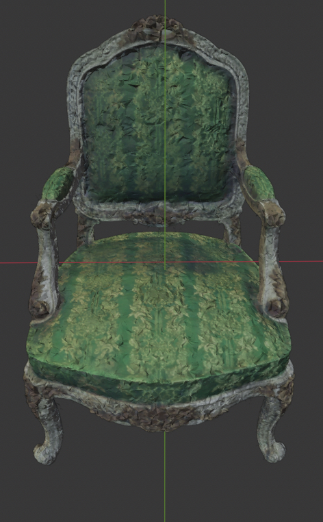

# Aim
This project aims to integrate the [nerf2mesh](https://me.kiui.moe/nerf2mesh/) method suggested by Jiaxiang Tang et al, with NerfStudio. 

# Train

## Using nerfstudio cli

### Stage 0
```
NERFSTUDIO_METHOD_CONFIGS=nerf2mesh=nerf2mesh.config:nerf2mesh ns-train nerf2mesh \
--stage \
0 \
--output-dir \
outputs/chair+mesh/nerf2mesh \
--logging.local-writer.max-log-size=0 \
--pipeline.model.coarse-mesh-path \
outputs/chair+mesh/nerf2mesh/meshes/mesh_0.ply \
meshes/stage_0_n2m/mesh_0.ply \
--pipeline.model.mark-unseen-triangles \
True \ 
--data \
~/datasets/nerf_synthetic_small/nerf_synthetic/chair/

```

### Stage 1

NOTE: The load dir needs to be updated to the path of nerfstudio_models in stage 0
```
NERFSTUDIO_METHOD_CONFIGS=nerf2mesh=nerf2mesh.config:nerf2mesh ns-train nerf2mesh \
--stage \
1 \
--output-dir \
outputs/chair+mesh/nerf2mesh \
--load_dir \
outputs/chair+mesh/nerf2mesh/chair/nerf2mesh/2024-02-16_132246/nerfstudio_models \
--max_num_iterations=10000 \
--logging.local-writer.max-log-size=0 \
--pipeline.model.coarse-mesh-path \
outputs/chair+mesh/nerf2mesh/meshes/mesh_0.ply \
meshes/stage_0_n2m/mesh_0.ply \
--pipeline.model.fine-mesh-path \
outputs/chair+mesh/nerf2mesh/meshes/stage_1/ \
--pipeline.model.mark-unseen-triangles \
False \ 
--project_name=nerf2mesh_nerfstudio \
--experiment_name=chair \
--vis=viewer \
--data \
~/datasets/nerf_synthetic_small/nerf_synthetic/chair/
```

## Using script

### Train both stages

```
python3.10 end_to_end_train.py --data path_to_transform.json --output_dir path_to_output_dir
```

You can also use the launch.json in the .vscode for starting debugging sessions.

# Example result

Chair Mesh




# Acknowledgements

This code is adapted directly from the original implementation of [Nerf2mesh](https://github.com/ashawkey/nerf2mesh)